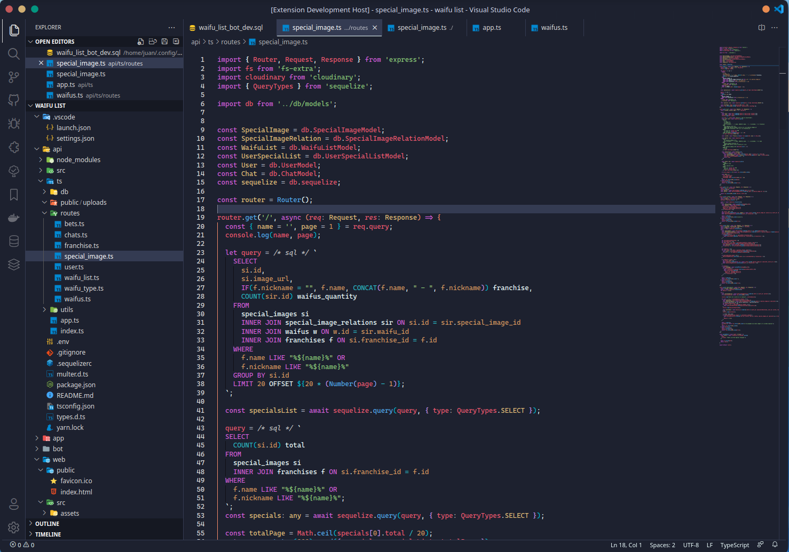
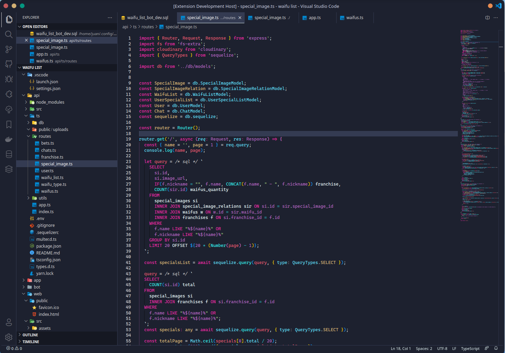
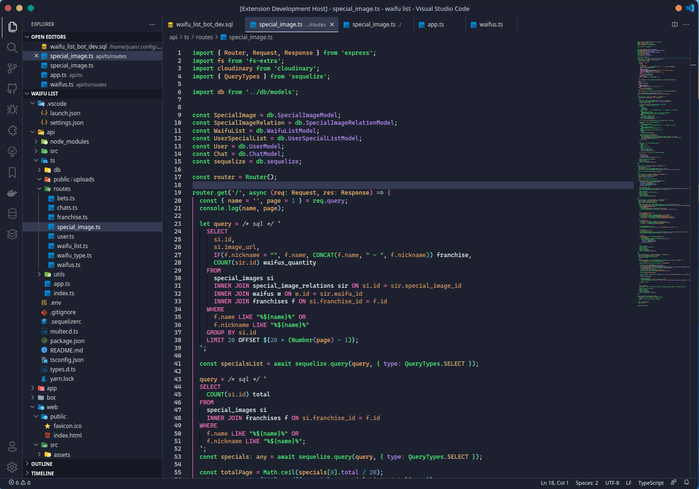
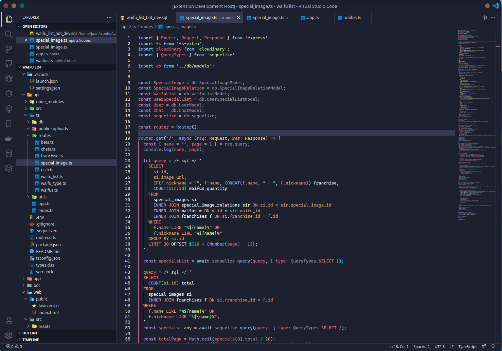
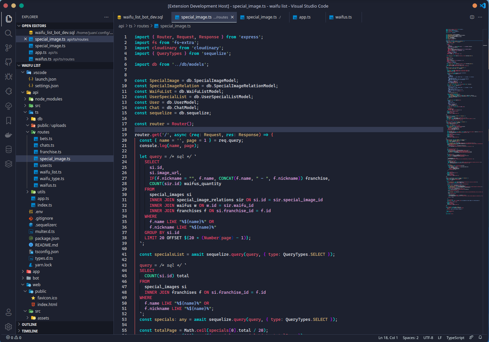
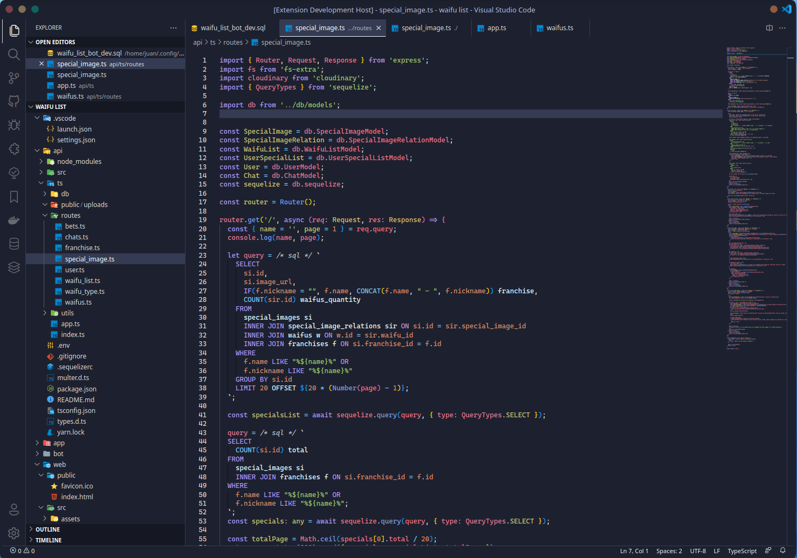

# [Terrafuture Themes for vscode](https://marketplace.visualstudio.com/items?itemName=JDGN.jcolors)

  **Note:** Many UI elements are intentionally low contrast so as not to distract. I can provide [customization settings](https://code.visualstudio.com/api/references/theme-color) similar to what is shown further down this page to anyone who needs specific text brightened.
  [Submit an issue](https://github.com/jdgn94/jcolors-themes/issues/new) if detect any consistence.

## Screenshots

### JC Dark

  

### JC 80's Dark

  

### JC Dracula Dark

  

### JC Material Dark

  

### JC Neon Dark

  

### JC Tokyo Dark

  